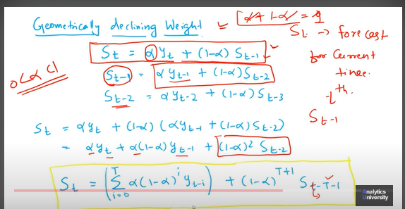

```{r setup, include=FALSE}
knitr::opts_chunk$set(echo = TRUE)
```

## Holt Winters Method 


```{r}

library(tidyverse)      # data manipulation and visualization
library(lubridate)      # easily work with dates and times
library(fpp2)           # working with time series data
library(zoo)
library(ggplot2)
library(plyr)
library(dplyr)
library(knitr)
library(TTR)
library(hydroGOF)


```


We first import our data 
```{r}
#URL HPi5
Demanda_electrico_importado <-read.csv("C:\\Users\\llell\\Documents\\MIS\\Second_semester\\Pronosticos_UNAM_HPi5\\pronosticos_UNAM_git\\pronosticos_UNAM_gitHub\\Demanda_electrico_2022_full1.csv", header= TRUE)
```


We checked the importing has worked 
```{r}
head(Demanda_electrico_importado)
summary(Demanda_electrico_importado)
typeof(Demanda_electrico_importado)
dim(Demanda_electrico_importado)
```


We add a new columns in a data type of data by transforming our 'original' Date columns into an as.date column 

```{r}
Demanda_electrico_importado$as.date <- as.Date(Demanda_electrico_importado$Date, format = "%m/%d/%Y")
head(Demanda_electrico_importado)
tail(Demanda_electrico_importado)
typeof(Demanda_electrico_importado)
dim(Demanda_electrico_importado)

```


#### To be able to use HoltWinters Methond in R, our data must be in a 'time series' type of data, time series methods come from the forecast library


```{r}
Demanda_electrico_importado.ts<- ts(Demanda_electrico_importado$Demanded_Gas, frequency = 12, start =c(2005,1), end =c(2022,8))
head(Demanda_electrico_importado.ts)

typeof(Demanda_electrico_importado.ts)
dim(Demanda_electrico_importado.ts)
```


Then we plot the 'original demanded gas in electric time series'
```{r}
plot(Demanda_electrico_importado.ts, col = "red", main = "Demanda electrico 'original' ")

```


Then we are able to apply the HoltWinters method 

```{r}
Demanda_electrico_HW <- HoltWinters(Demanda_electrico_importado.ts)
head(Demanda_electrico_HW)
tail(Demanda_electrico_HW)
typeof(Demanda_electrico_HW)
```


Let´s forecast next year´s gas use in electric sector 

```{r}
Demanda_electrico_forecast_HW_1 <-forecast(Demanda_electrico_HW, h=12)
head(Demanda_electrico_forecast_HW_1)
tail(Demanda_electrico_forecast_HW_1)
typeof(Demanda_electrico_forecast_HW_1)

```


Let's plot the forecast

```{r}
plot(Demanda_electrico_forecast_HW_1)

```


Let's see the error metrics

```{r}
accuracy(Demanda_electrico_forecast_HW_1)

```


Let´s plot original serie vs Holt Winters

```{r}
plot(Demanda_electrico_importado.ts, col = "red", main = "Demanda electrico 'original'vs Holt-Winters ")
lines(Demanda_electrico_forecast_HW_1, col="blue")
legend("bottomright", legend = c("Demanda electrico original", "Demanda electrico Holet Winters"), col = c("red", "blue"), lty = 1)

```


## Exponential smoothing

The idea behind: Forecast future values using a weighted average of all previous values in the series. 
Also with the idea that the weight asocciated with the previous values, decline over time


## Nonseasonal Methods

### Simple Exponential smoothing (SES)

Source https://www.youtube.com/watch?v=Fqge2HDH2Co

FOR SERIRES WITH NO TREND AND NO SEASONALITY

Weights all of the past data with exponentially decreasing weights going into the past. In other words, usually the more recent data has greater weight.
 

Single exponential smoothing has one parameter: The controlling smoothing factor for a particular level alpha (a) is the smoothing constant. The value of alpha can be any number between 0 and 1, not inclusive.  where the larger values of the predictive model mean it focuses on past observations, and the smaller values focus on history. Learning is fastest at one and slowest at zero values of alpha.


The smoothing coefficient or smoothing factor for that level is the single parameter/ hyperparameter denoted by (a) or alpha which controls the exponential decay influencing rate of past observations.


The weight of each and every parameter is always determined by alpha value described below: 

$$f_{t} = f(t-1) + \alpha (A(t-1)-f(t-1))$$

Where: 
$$f_{t} : Forecast-for-time-t ;$$
$$f(t-1) : Forecast for time t -1;$$
$$\alpha : smoothing-constant ( 0 ≤ α ≤ 1)$$
$$A(t-1) :previous-period’s actual-demand$$


```{r}

```


### Double Exponential smoothing (DES) or Holt´s Methods 


Source :https://docs.oracle.com/cd/E57185_01/CBPPU/classic_nonseasonal_forecasting_method_parameters.htm


Double exponential smoothing has two parameters: alpha and beta.  

The controlling smoothing factor for a particular level denoted by (a) alpha and the additional factor for smoothing and decay control of trend changes denoted by (b) or beta. The trends can change additively if the trend is linear and multiplicatively when the trend is exponential.


## Seasonal Methods

### Holt-Winters

Source: https://docs.oracle.com/cd/E57185_01/CBPPU/holt-winters_additive.htm


#### Holt-Winters additive 

Is an extension of Holt's exponential smoothing that captures seasonality. This method produces exponentially smoothed values for the level of the forecast, the trend of the forecast, and the seasonal adjustment to the forecast. This seasonal additive method adds the seasonality factor to the trended forecast, producing the Holt-Winters’ additive forecast.

This method is best for data with trend and seasonality that does not increase over time. It results in a curved forecast that shows the seasonal changes in the data.


#### Holt-Winters multiplicative 

Is similar to the Holt-Winters’ additive method. Holt-Winters’ Multiplicative method also calculates exponentially smoothed values for level, trend, and seasonal adjustment to the forecast. This seasonal multiplicative method multiplies the trended forecast by the seasonality, producing the Holt-Winters’ multiplicative forecast.

This method is best for data with trend and with seasonality that increases over time. It results in a curved forecast that reproduces the seasonal changes in the data.


## Classic Seasonal Forecasting Method Parameters


Source: https://docs.oracle.com/cd/E57185_01/CBPPU/classic_seasonal_forecasting_method_parameters.htm


The seasonal forecast methods use the following parameters:

alpha (α) — Smoothing parameter for the level component of the forecast. The value of alpha can be any number between 0 and 1, not inclusive.

beta (β) — Smoothing parameter for the trend component of the forecast. The value of beta can be any number between 0 and 1, not inclusive.

gamma (γ) — Smoothing parameter for the seasonality component of the forecast. The value of gamma can be any number between 0 and 1, not inclusive.

phi (Φ) — Damping parameter; any number between 0 and 1, not inclusive.


