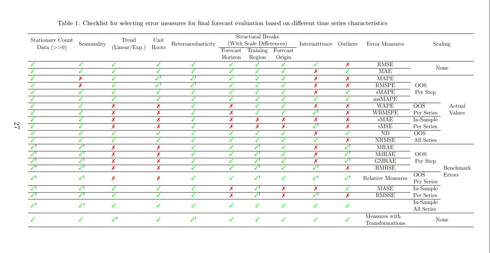

```{r setup, include=FALSE}
knitr::opts_chunk$set(echo = TRUE)
```

# Materia: Pronosticos
# Dr. Jair Morales C. 

## Alumno: Ibarra Raramírez Sergio (414025796)
## Fecha: Feb.2023


## Tipos de errores en el pronóstico

Comenzaremos instalando las liberias necesarias para el desarrollo 

Instalaremos el package HydroGOF que nos permitirá calcular todo tipo de errores dados un valor "observado" y uno "calculado" 
```{r}
##install.packages("hydroGOF", repos = "http://cran.r-project.org/")
```


```{r}

library(tidyverse)      # data manipulation and visualization
library(lubridate)      # easily work with dates and times
library(fpp2)           # working with time series data
library(zoo)
library(ggplot2)
library(plyr)
library(dplyr)
library(knitr)
library(TTR)
library(hydroGOF)


```


Vamos a importar el documento csv que contiene la demanda de gas natural en el sector eléctrico Mexicano 
(Si se importa el archivo full1 incluirá las columnas de date & demanded_gas)
```{r}
#URL desktop dell
#Demanda_electrico_importado <-read.csv("C:\\Users\\Sergio\\Documents\\MIS\\Second_semester\\Pronosticos_UNAM\\pronosticos_UNAM_git\\pronosticos_UNAM_gitHub\\Demanda_electrico_2022_full1.csv", header= TRUE)

#URL HPi3
Demanda_electrico_importado<-read.csv("C:\\Users\\sergi\\OneDrive\\Documentos\\MIS_UNAM\\Segundo_semestre\\Pronosticos_UNAM_HPi3\\pronosticos_UNAM_git\\Demanda_electrico_2022_full1.csv", header= TRUE)

#URL HPi5
#Demanda_electrico_importado <-read.csv("C:\Users\\llell\\Documents\\MIS\\Second_semester\\Pronosticos_UNAM_HPi5\\pronosticos_UNAM_git\\pronosticos_UNAM_gitHub\\Demanda_electrico_2022_full1.csv", header= TRUE)

```

Comprobemos que el documento Demanda_electrico_importado se haya importado correctamente.Corroboremos su tipo de dato("list") y sus dimensiones (213x2)

```{r}
head(Demanda_electrico_importado)
summary(Demanda_electrico_importado)
typeof(Demanda_electrico_importado)
dim(Demanda_electrico_importado)
```

AGREGAMOS UNA NUEVA COLUMNA en un tipo de formato de fecha a la "list" Demanda_electrico_importado 
Demanda_electrico_importado sigue siendo una "list" pero de 213 x 3 de Dim
```{r}
Demanda_electrico_importado$as.date <- as.Date(Demanda_electrico_importado$Date, format = "%m/%d/%Y")
head(Demanda_electrico_importado)
tail(Demanda_electrico_importado)
typeof(Demanda_electrico_importado)
dim(Demanda_electrico_importado)

```


Guardemos en variables los días min y max para poder usar en funcion ts 
```{r}
typeof(Demanda_electrico_importado$as.date)
min_date = min(Demanda_electrico_importado$as.date, na.rm = T)
min_date
max_date =max(Demanda_electrico_importado$as.date, na.rm = T)
max_date
```


Usemos la funcion ts. de R para "hacer los datos de nuestra serie" un dato "tipo serie en R"
En este caso de manera específca la columna de Demanded_gas

TODO INDICA QUE AL HACER ESTE CAMBIO SE CAMBIA EL TIPO DE DATO PUES Demanda_electrico_importado es de tipo lista con dimensiones 213x3
PERO Demanda_electrico_impoartdo.ts es de tipo "double" con dimensiones NULL

```{r}
Demanda_electrico_importado.ts<- ts(Demanda_electrico_importado$Demanded_Gas, frequency = 12, start =c(2005,1), end =c(2022,8))
head(Demanda_electrico_importado.ts)

typeof(Demanda_electrico_importado.ts)
dim(Demanda_electrico_importado.ts)
```


Grafica de la serie "ajustada a serie de tiempo"
```{r}
plot(Demanda_electrico_importado.ts, col = "red", main = "Demanda electrico 'original' ")

```

Una vez teniendo el objeto como ts, le podemos "aplicar el smoothing method called MA" 


Agregando "suavizamiento con Moving Average usado la libreria forecast" -MA orden 3 y centrado-
```{r}
library(forecast)
MA_m3_center <- forecast::ma(Demanda_electrico_importado.ts, order=3, centre = TRUE)
MA_m3_center
typeof(MA_m3_center)
dim(MA_m3_center)
```


Ploteando la serie original vs MA_m3_center
```{r}
plot(Demanda_electrico_importado.ts, col = "red", main = "Demanda electrico 'original'vs MA_m3_center ")
lines(MA_m3_center, col="blue")
legend("bottomright", legend = c("Demanda electrico original", "Demanda electrico MA_m3_center"), col = c("red", "blue"), lty = 1)

```


(Primero tuvimos que definir la función movavg -https://github.com/cran/pracma/blob/master/R/movavg.R)
```{r}

movavg <- function(x, n, type=c("s", "t", "w", "m", "e", "r")) {
    stopifnot(is.numeric(x), is.numeric(n), is.character(type))
    if (length(n) != 1 || ceiling(n != floor(n)) || n <= 1)
        stop("Window length 'n' must be a single integer greater 1.")
    nx <- length(x)
    if (n >= nx)
        stop("Window length 'n' must be greater then length of time series.")
    y <- numeric(nx)

    type <- match.arg(type)
    if (type == "s") {         # simple
        for (k in 1:(n-1))  y[k] <- mean(x[1:k])
        for (k in n:nx)     y[k] <- mean(x[(k-n+1):k])

    } else if (type == "t") {  # triangular
        n <- ceiling((n + 1)/2)
        s <- movavg(x, n, "s")
        y <- movavg(s, n, "s")

    } else if (type == "w") {  # weighted
        for (k in 1:(n-1))  y[k] <- 2 * sum((k:1)*x[k:1]) / (k*(k+1))
        for (k in n:nx)     y[k] <- 2 * sum((n:1)*x[k:(k-n+1)]) / (n*(n+1))

    } else if (type == "m") {  # modified
        y[1] <- x[1]
        for (k in 2:nx)     y[k] <- y[k-1] + (x[k] - y[k-1])/n

    } else if (type == "e") {  # exponential
        a <- 2/(n+1)
        y[1] <- x[1]
        for (k in 2:nx)     y[k] <- a*x[k] + (1-a)*y[k-1]

    } else if (type == "r") {  # running
        a <- 1/n
        y[1] <- x[1]
        for (k in 2:nx)     y[k] <- a*x[k] + (1-a)*y[k-1]

    } else
        stop("The type must be one of 's', 't', 'w', 'm', 'e', or 'r'.")

    return(y)
}
```


Agregando "suavizamiento con Moving Average usado la función movavg"-MA orden 3 y NO centrado-
(En la función movavg se toman en cuenta solo los valores pasados y no los "futuros" es coo SI NO estuvierra centrado el cálculo)
```{r}
library(forecast)
MA_m3_NOcenter <- movavg(Demanda_electrico_importado.ts, n=3, type="s")
#Se debe de transformar de num a time series 
MA_m3_NOcenter <- ts(MA_m3_NOcenter,frequency = 12, start =c(2005,1), end =c(2022,8))
MA_m3_NOcenter
typeof(MA_m3_NOcenter)
dim(MA_m3_NOcenter)
```


Ploteando la serie original vs MA_m3_centervs MA_m3_NOcenter
```{r}
plot(Demanda_electrico_importado.ts, col = "red", main = "Demanda electrico 'original'vs MA_m3_center ")
lines(MA_m3_center, col="blue")
lines(MA_m3_NOcenter, col="green")
legend("bottomright", legend = c("Demanda electrico original", "Demanda electrico MA_m3_center", "Demanda electrico MA_m3_NOcenter"), col = c("red", "blue", "green"), lty = 1)
```


Ahora recordemos que hemos estado teniendo porblemas para "fusionar" la "list" Demanda_electrico_importado
y los double MA_3_Center &MA_3_Center_NOcenter pues indicaba el error que la data era de 213 rows y  lo que queramos incluir era de 2012. Entonces usams una "especie de placeholder" que indique que si no tiene un valor le ponga NA
y asi poder "igualar la dim" de los "objetos a unir" 

Intentemos transformar MA_3_Center a una con un placeholder 
MA_m3_center_placeholder esun tipo num de [1:123]
```{r}
MA_m3_center_placeholder <- c(MA_m3_center, NA)
MA_m3_center_placeholder

```

Intentemos transformar MA_3_Center_NOcenter a una con un placeholder 
MA_m3_NOcenter_placeholder esun tipo num de [1:123]
```{r}
MA_m3_NOcenter_placeholder <- c(MA_m3_NOcenter, NA)
MA_m3_NOcenter_placeholder

```


Ahora quiero agregar la variable MA_m3_center_placeholder a la lista Demanda_electrico_importado en una columna de nombre: Demand_MA3_Center


```{r}
Demanda_electrico_importado$Demand_MA3_Center <- MA_m3_center_placeholder
head(Demanda_electrico_importado$Demand_MA3_Center)
head(Demanda_electrico_importado)
typeof(Demanda_electrico_importado)
dim(Demanda_electrico_importado)

```


Agregando la data MA_m3_NOcenter_placeholde a la tabla Demanda_electrico_importado como unanueva columna de nombre: Demand_MA3_NOCenter

```{r}
Demanda_electrico_importado$Demand_MA3_NOCenter <- MA_m3_NOcenter_placeholder
head(Demanda_electrico_importado$Demand_MA3_NOCenter)
head(Demanda_electrico_importado)
typeof(Demanda_electrico_importado)
dim(Demanda_electrico_importado)
tail(Demanda_electrico_importado)
```

Vamos a plotear los vamores de "Demanda electrico original", "Demanda electrico MA_m3_center", "Demanda electrico MA_m3_NOcenter"

```{r}
plot(x=Demanda_electrico_importado$as.date, y=Demanda_electrico_importado$Demanded_Gas, col = "red", main = "Demanda electrico 'original'vs MA_m3_center vs MA_m3_center", type="l")
lines(x=Demanda_electrico_importado$as.date, y=Demanda_electrico_importado$Demand_MA3_Center, col="blue")
lines(x=Demanda_electrico_importado$as.date, y=Demanda_electrico_importado$Demand_MA3_NOCenter, col="green")
legend("bottomright", legend = c("Demanda electrico original", "Demanda electrico MA_m3_center", "Demanda electrico MA_m3_NOcenter"), col = c("red", "blue", "green"), lty = 1)
```

Vamos a "seoarar" las columnas que queremos comparar para calcular los errores, usando la libreria HydroGOF

electrico_demanded_reported es un tipo "num" de dim [1:213]
```{r}
electrico_demanded_reported <- as.numeric(Demanda_electrico_importado$Demanded_Gas)
electrico_demanded_reported
```


## Types of errors in forecasting (https://arxiv.org/ftp/arxiv/papers/1809/1809.03006.pdf)
https://search.r-project.org/CRAN/refmans/greybox/html/error-measures.html

### Error (magnitude of error): 𝔻1 = 𝐴𝑗 − 𝑃𝑗

The most “natural” method of determining point distance between the actual and predicted values is subtracting one from another. The result of subtraction is a magnitude of error (or just error). Following the currently accepted notation in forecasting, we will be subtracting predicted value from the actual.
Finding the magnitude of error is a straight forward and computationally efficient method. Other 
methods of determining point distance use the magnitude of error for further processing.
Also, the error is measured with the same units as the data under analysis (variable of interest). It  is easily interpretable. In many problems, our business objective or loss function is proportional to the difference between the actual and predicted values (not square or absolute value of this difference, as other point distances imply). 


The issue with this method may arise at the aggregation phase, when the positive and negative errors will be cancelling each other. It means that even with large (but having different signs) errors the result of calculating the performance metric may yield zero demonstrating a falsely high accuracy. On another hand, this property of a magnitude of error (showing the direction of 
error) may convey useful information, e.g. it may be used in analysis to determine whether the forecasting method tends to overestimate or underestimate actual values, i.e. biased. This distance is used in ME, MPE, etc.


### Absolute error: 𝔻2 = |𝐴𝑗 − 𝑃𝑗|
The idea behind the absolute error is to avoid mutual cancellation of the positive and negative 
errors. Absolute error has only non-negative values which facilitates aggregation of point  distances over the data set.
By the same token, avoiding potential of mutual cancelations has its price – skewness (bias)  cannot be determined. 

Absolute error preserves the same units of measurement as the data under analysis and gives all  individual errors same weights (as compared to squared error). This distance is easily  interpretable and when aggregated over a dataset using an arithmetic mean has a meaning of average error. 
The use of absolute value might present difficulties in gradient calculation of model parameters 
(Chai and Draxler, 2014). This distance is used in such popular metrics as MAE, MdAE, etc.


### Squared error: 𝔻3 = (𝐴𝑗 − 𝑃𝑗)2

Squared error follows the same idea as the absolute error – avoid negative error values and  mutual cancellation of errors. 

Due to the square, large errors are emphasized and have relatively greater effect on the value of  performance metric (if e > 1). At the same time, the effect of relatively small errors (e < 1) will  be even smaller. Sometimes this property of the squared error is referred to as penalizing extreme  errors or being susceptible to outliers. Based on the application, this property may be considered  positive or negative. For example, emphasizing large errors may be desirable discriminating  measure in evaluating models (Chai and Draxler, 2014). 

Squared error has unit measure of squared units of data. This may not be intuitive, e.g. squared 
dollars. This could be reversed at the aggregation phase by taking square root.
Squared error is acknowledged for its good mathematical properties. It is continuously 
differentiable which facilitates optimization.


#### Image of tye of errors (https://towardsdatascience.com/time-series-forecast-error-metrics-you-should-know-cc88b8c67f27)


```{r}

```


### Scale Dependent Metrics

Many popular metrics are referred to as scale-dependent (Hyndman, 2006). Scale-dependent means the error metrics are expressed in the units (i.e. Dollars, Inches, etc.) of the underlying data.

The main advantage of scale dependent metrics is that they are usually easy to calculate and interpret. However, they can not be used to compare different series, because of their scale dependency (Hyndman, 2006).

Please note here that Hyndman (2006) includes Mean Squared Error into a scale-dependent group (claiming that the error is “on the same scale as the data”). However, Mean Squared Error has a dimension of the squared scale/unit. To bring MSE to the data’s unit we need to take the square root which leads to another metric, the RMSE. (Shcherbakov et al., 2013)


#### Mean Absolute Error (MAE) 

The Mean Absolute Error (MAE) is calculated by taking the mean of the absolute differences between the actual values (also called y) and the predicted values (y_hat).

Avantages: It is easy to understand (even for business users) and to compute. It is recommended for assessing accuracy on a single series (Hyndman, 2006). 
Disadvantaes: However if you want to compare different series (with different units) it is not suitable. Also you should not use it if you want to penalize outliers.


$$MAE = \frac{1}{N}\sum_{1}^{n}\left |e_{t}  \right |=\sum_{1}^{n}\left |yi-\hat{yi} \right|$$


####  Mean Squared Error (MSE)


To put more attention on outliers (huge errors) you can consider the Mean Squared Error (MSE). Like it’s name implies it takes the mean of the squared errors (differences between y and y_hat). 

Due to its squaring, it heavily weights large errors more than small ones, which can be in some situations a disadvantage. Therefore the MSE is suitable for situations where you really want to focus on large errors. 

Due to its squaring the metric loses its unit.

Many algorithms (specially ML algorithms) use MSE as it is faster to compute and easier to manipulate than RMSE. But it is not scaled to the original error (as the error is squared), resulting in a KPI that we cannot relate to the original demand scale. Therefore, we won’t use it to evaluate our statistical forecast models.


$$ MSE = \frac{1}{N}\sum_{1}^{n}\left (e_{t})^2  \right|=\sum_{1}^{n}\left (yi-\hat{yi} \right)^2 $$
RMSE emphasizes the most significant errors, whereas MAE gives the same importance to each error.
 
 

####  Root Mean Squared Error (RMSE)


To avoid the MSE’s loss of its unit we can take the square root of it. The outcome is then a new error metric called the Root Mean Squared Error (RMSE).

It comes with the same advantages as its siblings MAE and MSE. However, like MSE, it is also sensitive to outliers.

Some authors like Willmott and Matsuura (2005) argue that the RMSE is an inappropriate and misinterpreted measure of an average error and recommend MAE over RMSE.

However, Chai and Drexler (2014) partially refuted their arguments and recommend RMSE over MAE for your model optimization as well as for evaluating different models where the error distribution is expected to be Gaussian.


$$ RMSE = {\sqrt{\frac{1}{N}\sum_{1}^{n}\left (e_{t})^2  \right|}} =\sqrt{\sum_{1}^{n}\left (yi-\hat{yi} \right)^2}$$


### Percentage Error Metrics

As we know from the previous chapter, scale dependent metrics are not suitable for comparing different time series.

Advantage: Percentage Error Metrics solve this problem. They are scale independent and used to compare forecast performance between different time series. 
Disadvantage: Their weak spots are zero values in a time series. Then they become infinite or undefined which makes them not interpretable (Hyndman 2006).


####  Mean Absolute Percentage Error (MAPE)


The mean absolute percentage error (MAPE) is one of the most popular used error metrics in time series forecasting. It is calculated by taking the average (mean) of the absolute difference between actuals and predicted values divided by the actuals.

MAPE’s advantages are it’s scale-independency and easy interpretability. As said at the beginning, percentage error metrics can be used to compare the outcome of multiple time series models with different scales.

However, MAPE also comes with some disadvantages. First, it generates infinite or undefined values for zero or close-to-zero actual values (Kim and Kim 2016).

Second, it also puts a heavier penalty on negative than on positive errors which leads to an asymmetry (Hyndman 2014).

MAPE have problems on large errors when y-values are close to zero and the large difference between the absolute percentage errors when y is greater than y-hat and vice versa.

And last but not least, MAPE can not be used when using percentages make no sense. This is for example the case when measuring temperatures. The units Fahrenheit or Celsius scales have relatively arbitrary zero points, and it makes no sense to talk about percentages (Hyndman and Koehler, 2006).


$$ MAPE = \frac{1}{N}\sum_{1}^{n}\left (\frac{yi-\hat yi }{yi} \right)*100  $$ 


####  Symmetric Mean Absolute Percentage Error (sMAPE)


The sAMPE is the average across all forecasts made for a given horizon. It’s advantages are that it avoids MAPE’s problem of large errors when y-values are close to zero and the large difference between the absolute percentage errors when y is greater than y-hat and vice versa. Unlike MAPE which has no limits, it fluctuates between 0% and 200% (Makridakis and Hibon, 2000).


$$ sMAPE = \frac{1}{N}\sum_{1}^{n}\left(\frac{|yi-\hat yi |}{|yi|+\hat |yi|/2} \right) $$ 


### MAE VS RMSE

#### RMSE "optimization"

Let’s take some time to understand why a forecast of the median will get a good MAE and a forecast of the mean a good RMSE

https://towardsdatascience.com/forecast-kpi-rmse-mae-mape-bias-cdc5703d242d


To simplify the following algebra, let’s use a simplified version: the Mean Squared Error (MSE):


$$ MSE = \frac{1}{N}\sum_{1}^{n}\left (e_{t})^2  \right|=\sum_{1}^{n}\left (yi-\hat{yi} \right)^2 $$
If you set MSE as a target for your forecast model, it will minimize it. One can minimize a mathematical function by setting its derivative to zero. Let’s try this.


```{r}

```

Conclusion to optimize a forecast’s MSE, the model will have to aim for the total forecast to be equal to the total demand. That is to say that optimizing MSE aims to produce a prediction that is correct on average and, therefore, unbiased.


#### MAE "optimization"


```{r}

```

or

```{r}

```

and


```{r}

```

which means:


```{r}

```


Conclusion to optimize MAE (i.e., set its derivative to 0), the forecast needs to be as many times higher than the demand as it is lower than the demand. In other words, we are looking for a value that splits our dataset into two equal parts. This is the exact definition of the median.


Let’s take some time to discuss the impact of choosing either RMSE or MAE on bias, sensitivity to outliers, and intermittent demand.


#### BIAS 

For many products, you will observe that the median is not the same as the average demand. The demand will most likely have some peaks here and there that will result in a skewed distribution. These skewed demand distributions are widespread in supply chains as the peaks can be due to periodic promotions or clients ordering in bulk. This will cause the demand median to be below the average demand, as shown below.


```{r}

```


This means that a forecast that is minimizing MAE will result in a bias. In comparison, a forecast minimizing RMSE will not result in bias (as it aims for the average). This is definitely MAE’s main weakness.


#### Sensitivity to outliers


As we discussed, RMSE gives greater importance to the highest errors. This comes at a cost: a sensitivity to outliers. Let’s imagine an item with the following demand pattern


Generally speaking, the median is more robust to outliers than the average. This is rather important in a supply chain environment as we can face many outliers due to encoding mistakes or demand peaks (marketing, promotions, spot deals).


### Ejemplo de calculo de varios tipos de errores para el dos casos de suavizamientos

Ahora implementemos la función gof que nos permitirá calcular "muchos tipos de errores" entre dos vectores de datos dados 
(https://www.youtube.com/watch?v=WBbOh-Z1dmE)


#### electrico_demanded_reported vs MA_M3_center_placeholder

Tipos de errores entre electrico_demanded_reported vs MA_M3_center_placeholder 
```{r}
gof(sim=MA_m3_center_placeholder, obs=electrico_demanded_reported)

```

Para calcular el MAPE entre electrico_demanded_reported y MA_m3_center_placeholder

```{r}
mape_Reported_vs_MA3Center <- mean(abs((electrico_demanded_reported - MA_m3_center_placeholder) / electrico_demanded_reported), na.rm=TRUE) * 100
mape_Reported_vs_MA3Center

```

En general se nota que "los pronósticos de MA_3_Centrados están desviados por entre 72-111 "puntos"
Lo que respresenta un 2.28% de error poercentual


#### electrico_demanded_reported vs MA_M3_NOcenter_placeholder

Tipos de errores entre electrico_demanded_reported vs MA_M3_NOcenter_placeholder 
```{r}
gof(sim=MA_m3_NOcenter_placeholder, obs=electrico_demanded_reported)

```


Para calcular el MAPE entre electrico_demanded_reported y MA_m3_NOcenter_placeholder

```{r}
mape_Reported_vs_MA3_NO_Center <- mean(abs((electrico_demanded_reported - MA_m3_NOcenter_placeholder) / electrico_demanded_reported), na.rm=TRUE) * 100
mape_Reported_vs_MA3_NO_Center

```

En general se nota que "los pronósticos de MA_3_NO_Centrados están desviados por entre 118-171 "puntos"
Lo que respresenta un 3.87% de error poercentual


```{r}

```


https://arxiv.org/pdf/2203.10716.pdf

For example, measures with squared base errors such as MSE and RMSE optimise for the mean whereas others with absolute value base errors such as MAE and Mean Absolute Scaled Error (MASE) optimise for the median.
Although the mean and median are the same for a symmetric distribution, that does not hold for skewed distributions as
with intermittent series. There exist numerous controversies in the literature regarding this.
Petropoulos et al. (2020) suggest that it is not appropriate to evaluate the same forecastsusing many different error measures, since each one optimises for a different statistics of the distribution

Kolassa (2020) further argues that, if the ultimate evaluation measure is, e.g., MAE which focusses on the median of the distribution, it does not make sense to optimise the models using an error measure like MSE (which accounts for the mean). It
is more meaningful to consider MAE also during model training as well.


