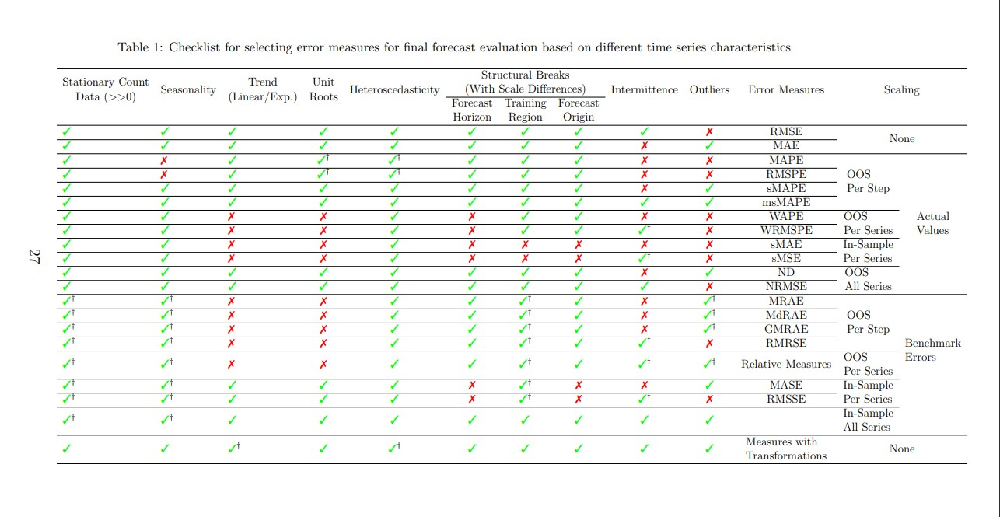

```{r setup, include=FALSE}
knitr::opts_chunk$set(echo = TRUE)
```

# Materia: Pronosticos
# Dr. Jair Morales C. 

## Alumno: Ibarra Raramírez Sergio (414025796)
## Fecha: Feb.2023, Clase 21.Feb.2023 Métodos de descomposición de series 


## Text


Comenzaremos instalando las liberias necesarias para el desarrollo 

```{r}

library(tidyverse)      # data manipulation and visualization
library(lubridate)      # easily work with dates and times
library(fpp2)           # working with time series data
library(zoo)
library(ggplot2)
library(plyr)
library(dplyr)
library(knitr)
library(TTR)
library(hydroGOF)


```


Instalaremos el package HydroGOF que nos permitirá calcular todo tipo de errores dados un valor "observado" y uno "calculado" 

```{r}
install.packages("hydroGOF", repos = "http://cran.r-project.org/")
```


```{r}

```


#### Tendencia, Estacionalidad y "Ruido" en las series de tiempo
Recordar que en las series de tiempo se poríaan identificar 3 componentes típicos: 
T-Tendencia
E-Estacionalidad
A-Componente aleatorio o ruido blanco


$$L = g(T,E,A)$$
Cuando tendencia y estacionalidad no están asociadas (MODELO ADITIVO)
$$y_{t1}= T_{t} + E_{t}+ A_{t}$$


Cuando tendencia y estacionalidad SI están asociadas (MODELO MULIPLICATIVO)

$$y_{t2}= T_{t} * E_{t}+ A_{t}$$

```{r}

```


Dada una serie de tiempo 
a) Se suavizará mediante MA, WMA, EMA, etc
b) Se puede estimar la tendencia 
"con un modleo lineal"

$$T_{t} = b0 + b1*t$$
(Se pueden tener también tendecias de tipo exponencial y/o polinomio por ejemplo)

Exponencial:

$$T_{t} =b0*e^{b1*t}$$

Polinomio:

$$T_{t} =b0 + b1*t + b1*t^2$$

c) Se establece una corrección 
con la SERIE SUAVIZADA

Mediante un modelo de tiepo por ejemplo (Aditivo o multiplicativo) 

De esto se obtendrá una serie Resifual Wt que ya solamente incluirá el efecto estacional

Para el caso de MODELOS ADITIVOS 

$$W_{t} = y_{t}-\ y_{t} <media>$$

Entonces una vez suavizada, podemos calcular la tendencia (lineal, exponencial, polinomial). Una vez estimada la tendencia se tiene "una nueva serie  de tiempo" una serue residual, de tal manera que a la serie original se le quita el uavizamiento y lo que se deja es la estacionalidad 


Para el caso de MODELOS MULTIPLICATIVOS 

$$W_{t} = y_{t}-/ y_{t} <media>$$


d) Ahora se pasaría al analisis de los"componentes de estacionalidad".

Sea Ei estimación de cada componente estacional (mensual, trimestral, semestral, etc)

Y sea S el total de observaciones para cada componente.

Y sea ei la observación para cada Ei

El componente (ya sea bimestral, trimestral, etc) va a ser el promedio de los (meses, trimeses, semestres, de esa serie de tiempo)

$$E_{i} = \frac{1}{s}*\sum_{h=1}^{s}e_{h}$$


e) Por último la preddicción sería 

-Para el caso aditivo: 

$$Y<estimada>_{i} = T<tendencia>_{t} + E<estacionalidad>_{i}$$


-Para el caso Multiplicativo: 

$$Y<estimada>_{i} = T<tendencia>_{t} * E<estacionalidad>_{i}$$


```{r}

# Create the data frame
serie_original <- data.frame(
  Trimestre = c("1er", "2do", "3er", "4to"),
  `2003` = c(120, 90, 90, 100),
  `2004` = c(130, 110, 110, 130),
  `2005` = c(140, 120, 110, 150),
  `2006` = c(150, 140, 140, 170),
  `2007` = c(180, 180, 170, 170)
)

# Print the data frame
serie_original

```


```{r}
serie_original$X2003
typeof(serie_original$X2003)
```


### Continuación de la clase del 21.Feb.2023 para revisión de algunos métodos en R


```{r}
library(TTR)
accTV <-c(71,70,69,68,64,65,72,78,75,75,75,70,75,75,74,78,86,82,75,73,72,73,72,77,83,81,81,85,85,84)
accTV
length(accTV)
```


```{r}
sm1 <- filter(accTV,rep((1/5),5),sides=1) ##Sin retardo central
sm1
```


```{r}
sm2 <- filter(accTV,rep((1/5),5),sides=2) ##CON retardo central
sm2
```


#### Medias moviles ponderadas (WMA)

```{r}
wts<-c(0.15,0.15,0.3,0.2,0.2)
swm1 <-WMA(accTV, n=5, wts=wts)
swm1

```


#### Suavizamiento exponencial (EMA)
A mayor "inestabilidad" se busca´ria un s

```{r}
sexp1 <-EMA(accTV, n=1, ratio=0.1)
sexp1
length(sexp1)

```

Con alpha 0.3

```{r}
sexp3 <-EMA(accTV, n=1, ratio=0.3)
sexp3
length(sexp3)

```


Con alpha 0.8

```{r}
sexp8 <-EMA(accTV, n=1, ratio=0.8)
sexp8
length(sexp8)

```


```{r}
plot(accTV, main="Precio de acciones en funcion del tiempo", xlab="Semanas", ylab="Precio de acciones", col="red", type="l")
lines(sexp3, col="green")
lines(sexp8, col="blue")

```


Ahora haremos uso de la librería Forecast
```{r}
library(forecast)
```


Definamos una nueva serie
```{r}
sales_original <- c(197,211,203,247,239,269,308,262,258,256,261,288,296,276,305,308,356,393,363,386,443,308,358,384,358,325,414,406,425,347,413,435,407,438,479,373,437,500,535,525,449,557,543,433,475,592,548,520)
sales_original
```


Transformamos nuestra data a un tipo de dato "serie de tiempo"
```{r}
sales_ts <- ts(sales_original, frequency=12, start=(2005))
sales_ts
```


Ploteamis la serie del tiempo 
```{r}
plot(sales_ts)
```


Suavizamiento exponencial doble 
```{r}
sales_exp<-ets(sales_original, alpha=0.1, additive.only=TRUE)
sales_exp
```


